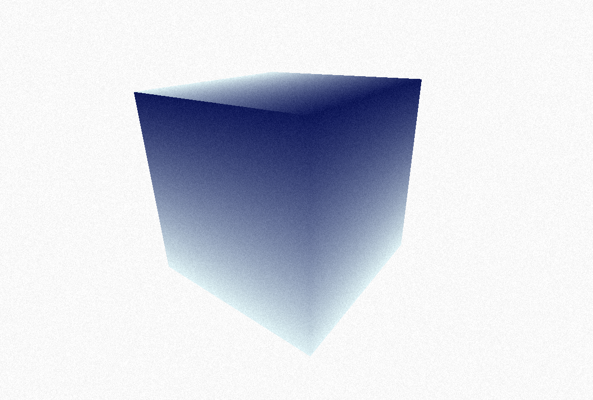

## effect-threejs

link <a href="https://tarquibrian.github.io/noisethreejs/" target="_blank">Example</a>


# INFO

<h3>


 </h3>

   


effect-threejs is an example of a noise effect for `threejs`, which contains custom shaders that make such a visual effect possible.



# Installation

1. Install Threejs (preferably, version >= 0.140.0)

  ```bash
npm install
npm run dev
```

# Recommended configurations

1. Use Threejs latest version (preferably, version >= 0.140.0)

2. Use useMemo(uniforms) for update color values

  ```tsx
  const uniforms = useMemo(
    () => ({
      color1: {
        value: new THREE.Color("#ebf4f5"),
      },
      color2: {
        value: new THREE.Color("#133a94"),
      },
    }),
    []
  );
  ```
3. Use useframe for rendering mutations

```tsx
useFrame(() => {
    mesh.current.rotation.z += 0.004;
    mesh.current.rotation.x += 0.004;
    mesh.current.rotation.y += 0.004;
  });
```

# SUPPORT

<a href="https://www.buymeacoffee.com/tarquibrian" target="_blank" rel="noopener noreferrer"></a>

# License

The MIT License (MIT) 2023 - [Tarqui Brian](https://github.com/tarquibrian/). Please have a look at the [LICENSE.md](LICENSE) for more details.
